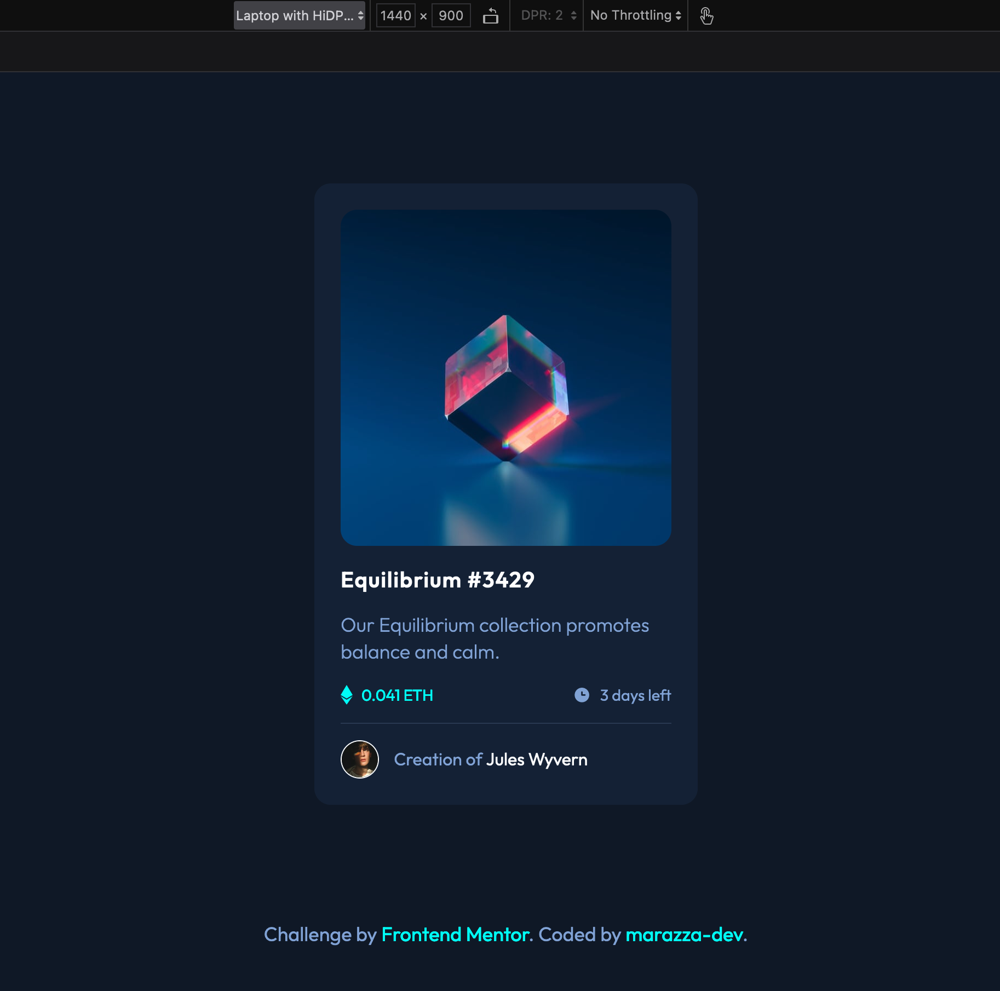
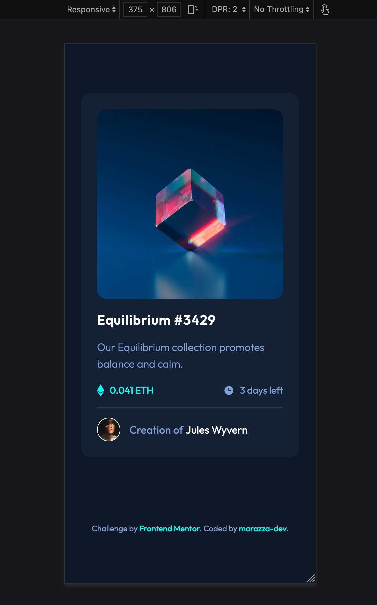

# Frontend Mentor - NFT preview card component solution

This is a solution to the <a href="https://www.frontendmentor.io/challenges/nft-preview-card-component-SbdUL_w0U" target="_blank">NFT preview card component challenge on Frontend Mentor</a>. Frontend Mentor challenges help me improve my coding skills by building realistic projects.

## Table of contents

- [Frontend Mentor - NFT preview card component solution](#frontend-mentor---nft-preview-card-component-solution)
  - [Table of contents](#table-of-contents)
  - [Overview](#overview)
    - [The challenge](#the-challenge)
    - [Screenshots](#screenshots)
    - [Links](#links)
  - [My process](#my-process)
    - [Built with](#built-with)
    - [What I learned](#what-i-learned)
    - [Continued development](#continued-development)
    - [Useful resources](#useful-resources)
  - [Author](#author)

## Overview

### The challenge

Users should be able to:

- View the optimal layout depending on their device's screen size (375px and 1440px)
- See hover states for interactive elements

### Screenshots




### Links

- Solution URL: [Add solution URL here](https://your-solution-url.com)
- Live Site URL: [Add live site URL here](https://your-live-site-url.com)

## My process

### Built with

- HTML5 markup
- <a href="https://sass-lang.com/" target="_blank">Dart Sass</a>
- CSS3 custom properties
- BEM naming convention
- Flexbox

### What I learned

The importance of using CSS pseudo-elements in order to create layout components such as the image overlay and the break line.

```scss
// LINE BREAK
&::before {
  content: "";
  width: 100%;
  height: 1px;
  position: absolute;
  top: -1rem;
  left: 0;
  background: $clr-line;
}
```

```scss
// IMAGE OVERLAY
&::after {
  content: "";
  width: 100%;
  height: 100%;
  position: absolute;
  display: none;
  cursor: pointer;
  top: 0;
  left: 0;
  border-radius: 15px;
  background-image: url("../images/icon-view.svg");
  background-repeat: no-repeat;
  background-position: center;
  background-color: hsla(178, 100%, 50%, 0.589);
}
&:hover {
  &::after {
    display: unset;
  }
}
```

### Continued development

I need to get more used to BEM naming convention with Sass super powers and improve my HTML semantic markup.

### Useful resources

- <a href="https://www.youtube.com/watch?v=zGiirUiWslI" target="_blank">Kevin Powell</a> - Before and After pseudo elements - YouTube
- <a href="https://sparkbox.com/foundry/bem_by_example" target="_blank">BEM Naming Convention</a> - Greate explanation of BEM by examples.

## Author

- Frontend Mentor - <a href="https://www.frontendmentor.io/profile/marazza-dev" target="_blank">@marazza-dev</a>
- Twitter - <a href="https://twitter.com/marazza_dev">@marazza_dev</a>
